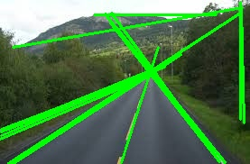

# Lane Detection & Path Planning

This project demonstrates a **classical computer vision + path planning pipeline** using OpenCV and A* algorithm.

## Features
-  Lane detection using OpenCV (Canny + Hough Transform)  
-  Grid-based A* path planning  
-  Designed to **show clear failure modes** with small datasets  

## Why Classical Methods?
I deliberately chose classical methods instead of lightweight CNNs:  
-  Transparent: easier to debug and understand  
-  Controlled: small datasets make failure modes obvious  
-  Example failure: horizon detection fails under glare conditions  

## Files
- `lane_detection.py` → lane detection with OpenCV  
- `astar_planner.py` → grid-based A* search  
- `demo.ipynb` → notebook with sample visualizations  

## Future Improvements
- Integrate CNN for robustness  
- Better horizon detection under light variation  
- Combine with vehicle dynamics models  

## Results (sample)
Here is a sample lane detection result:

